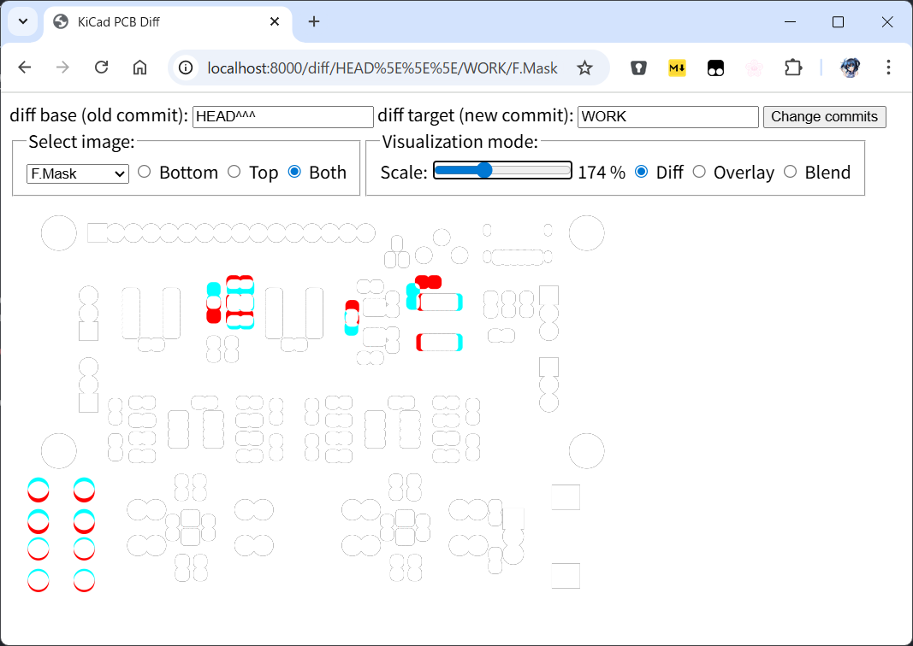

# kicad-diff-visualizer
A tool to visualize the difference of PCB layouts and schematics created by KiCad.

This tool recognizes a Git repository and visualizes the difference between two commits.
Typically it can be used
- when you write a commit log. You can recall what you've done on your design.
- when you check a commit history. It's hard to understand the actual changes based solely on text diffs.

One of this tool's key features is minimal external dependencies.
The core idea is to use kicad-cli, which is part of the standard KiCad installation,
to generate an image for each commit and calculate the differences.

## Requirements

- `git` command
  - Ubuntu: `sudo apt install git`
- GitPython >= 3.0
  - Ubuntu: `sudo apt install python3-git`
- Jinja >= 2.10
  - Ubuntu: `sudo apt install python3-jinja2`

## Screenshot

The server is showing the difference of the PCB layouts.
- White area means no diff.
- Red/blue area is only in the old/new commit.

## How to use

    $ ./run_server.sh /path/to/kicad_project_dir

Then, open http://localhost:8000/ with a Web browser.

`kicad_project_dir` is the directory containing .kicad_pro file.
Or you can specify a path to .kicad_pcb and/or .kicad_sch instead of the directory.
